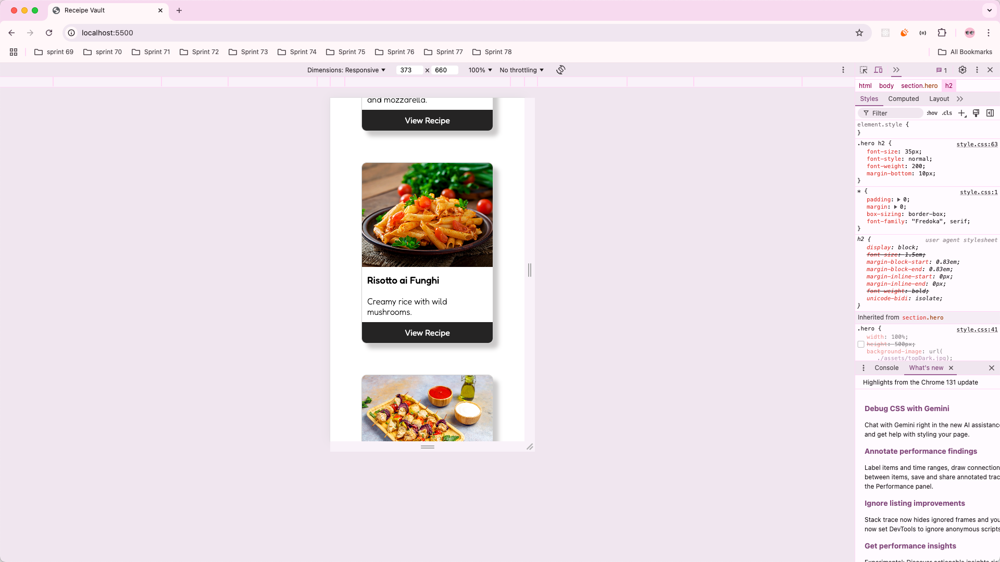
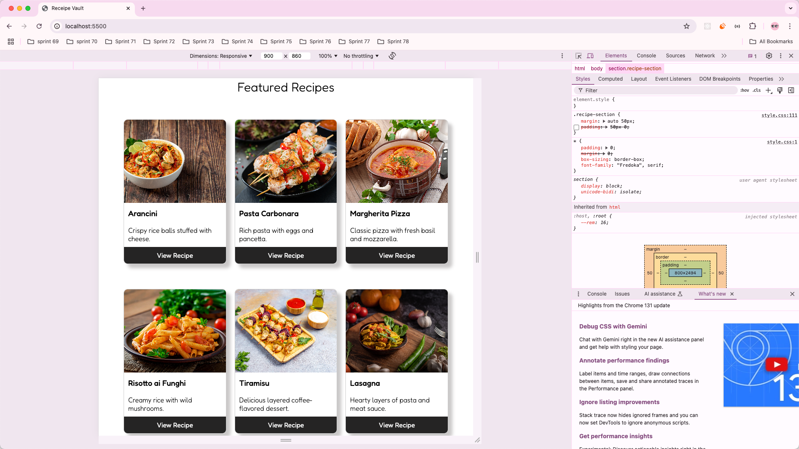

# RecipeVault

HTML-CSS  Design with a responsive layout for seamless browsing on both desktop and mobile devices.


Mobile Version

 


Mobile Version

 


Desktop Version

 


Desktop Version

 


Tablet Version

 


Learnings in this project are as follows -


# **how do I paste image in readme.md file from VS code editor**

* To include an image in your `README.md` file from VS Code, follow these steps:

  ### 1. **Add the Image to Your Project Folder**
  * Place the image file in your project directory (e.g., in an `assets` or `images` folder).

  ### 2. **Reference the Image in** `README.md`
  * Use Markdown syntax to link the image. For example:

    ```markdown
    
    ```
  * Replace `relative/path/to/image.png` with the relative path to your image file from the location of your `README.md` file.
  * BUT MOST IMPORTANTLY YOU SHOULD TYPE IT IN CODE FILE , THEN PASTE IT ON README FILE , BECAUSE IT’S NOT EASY TO EDIT ABOVE CODE IN README . ALSO TO SEE CHANGES GOTO README FILE IN FOLDER AND RIGHT CLICK AND SELECT PREVIEW OPTION.

  Example:

  ```markdown
  
  ```

  ### 3. **Paste Image Directly into VS Code**
  * If you have an image copied to your clipboard, you can use an extension like **"Paste Image"** in VS Code:

    
    1. Install the [Paste Image](https://marketplace.visualstudio.com/items?itemName=mushanshitiancai.vscode-paste-image) extension.
    2. In your `README.md`, position the cursor where you want the image reference.
    3. Paste the image (`Ctrl+V` or `Cmd+V`).
    4. The extension will save the image to a predefined folder (e.g., `images`) and automatically insert the Markdown syntax for the image.

  ### 4. **Preview the Markdown**
  * Right-click in your `README.md` file and select **"Open Preview"** or press `Ctrl+Shift+V` (Windows/Linux) or `Cmd+Shift+V` (Mac) to see how the image appears.

  Let me know if you need more help!


# How to create a new repository for any new project

 

 


1. Clone this git CODE in vs code . you will see that you are working on main branch .
2. to be more practical in git , create a branch inside git and work on these branches , and keep on merging the code in the main branch. again always create a branch from main only.

# Why we often set `box-sizing: border-box ?`

### Default Behavior (`content-box`)

By default, the `box-sizing` property is set to `content-box`. In this mode:

* The **width** and **height** of an element only include the content.
* Padding and borders are added **outside** the specified width and height, which can cause elements to grow unexpectedly.

For example:

```css
div {
  width: 200px; /* Only content width */
  padding: 20px; /* Adds 40px total */
  border: 10px solid black; /* Adds 20px total */
}
```

The element's total width becomes **260px** (200 + 40 + 20), which can make layout calculations tricky.


### Using `border-box`

When `box-sizing: border-box` is applied:

* The **width** and **height** include content, padding, and borders.
* This means the element’s total size stays consistent with the width and height you specify.

For the same example:

```css
div {
  box-sizing: border-box;
  width: 200px; /* Includes content, padding, and border */
  padding: 20px;
  border: 10px solid black;
}
```

The total width remains **200px**, making it much easier to manage layouts.


### Benefits of `border-box`


1. **Predictable Layouts**: The size you set is the size you get, which reduces unexpected overflow and makes layout planning straightforward.


# Why do we always set `min-height: 100vh` and `width: 100%`


### Why `min-height: 100vh`?


1. **Viewport Relative Units for Height (**`100vh`):
   * `100vh` ensures the element’s height covers the **entire height of the viewport**, regardless of its content.
   * Using `min-height` allows the element to expand if its content exceeds the viewport height.
2. **Dynamic Content**:
   * For many layouts, vertical scrolling is more common. Using `min-height` ensures the container grows as needed for additional content.


### Why `width: 100%`?


1. **Percentage Units for Width (**`100%`):
   * `width: 100%` ensures the element stretches across the entire width of its parent or the viewport.
   * This works well because, unlike height, the content in most layouts naturally expands horizontally, so a **minimum width** isn't as important.
2. **No Horizontal Overflow by Default**:
   * Content doesn’t typically overflow horizontally (due to how text wraps), so `min-width` isn’t commonly needed in most layouts.


### Why Not Use `height: 100vh` or `min-width: 100vh`?


1. `height: 100vh`:
   * If you set `height: 100vh`, the element's height becomes **fixed** at the viewport height, even if the content overflows. This can cause issues where content gets **cut off** and scrolling is disabled unintentionally.
2. `min-width: 100vh`:
   * `vh` is a **vertical unit** and has no direct relation to the width of the viewport. Using `min-width: 100vh` can lead to unpredictable results because it bases the width on the height of the viewport instead of the width.


### Why Not Use `width: 100%` and `height: 100%` Together?


1. **Behavior of \`% Units**:
   * `width: 100%` works fine because it stretches the element to match its parent’s width (usually the viewport width).
   * `height: 100%`, however, depends on the **height of the parent**. If the parent doesn’t have a fixed height or a height defined, the element with `height: 100%` might collapse to `0` because percentages need a reference point.

   **Example of collapsing height**:

   ```css
   body, html {
     width: 100%;
   }
   
   div {
     width: 100%;
     height: 100%; /* May collapse without a defined parent height */
   }
   ```
2. **Viewport Units Are More Reliable for Height**:
   * `100vh` is absolute and always represents the viewport height, while `100%` depends on the parent element’s height.


# If `height: 100%` depends on the parent’s height and collapses to 0 when the parent has no fixed height, why does `width: 100%` work on the `<body>` tag even when the parent’s width isn’t explicitly defined?

Ah, great observation! The reason `width: 100%` works on the `<body>` tag (or similar elements) without explicitly setting the parent’s width, while `height: 100%` often fails, lies in **how browsers handle width and height differently by default**. Let’s dive into the explanation.


### 1. **Default Behavior of** `html` and `body` Elements

* **Width**: The `<html>` and `<body>` elements automatically stretch their width to fill the entire viewport width (even without explicitly setting `width`).
  * By default, the browser makes the `<html>` and `<body>` elements **block-level elements**, which naturally expand to match the width of their containing block (in this case, the viewport).
  * Therefore, `width: 100%` on the `<body>` simply means "take 100% of the already stretched width of the viewport."
* **Height**: The `<html>` and `<body>` elements **do not automatically stretch their height** to match the viewport unless explicitly set.
  * If no height is specified for `<html>` or `<body>`, their height is determined by the content inside. If the content is smaller than the viewport, their height collapses to the size of the content.
  * This means `height: 100%` won’t work properly unless the height of the parent (`<html>` or `<body>`) is explicitly defined (e.g., `height: 100vh` or `height: 100%` on `<html>`).


### 2. **Why** `width: 100%` Works Without a Set Parent Width

* **Width Cascades by Default**: Browsers treat the width of the `<html>` element as 100% of the viewport width by default. When you apply `width: 100%` to the `<body>` or its child elements, it simply inherits this width from the `<html>` element, which is already stretched to the full viewport width.
  * Even without explicitly setting `width: 100%` on `<html>`, it behaves as though `width: 100%` is applied because browsers assume that layout fills the viewport horizontally.
  * **Illustration**:

    ```css
    html, body {
      /* No width explicitly defined, but both take up full viewport width */
    }
    
    div {
      width: 100%; /* Works because it inherits from the full-width <body> */
    }
    ```


### **Summary of Key Differences**

| Property | Behavior for `<html>` and `<body>` | Why It Works/Fails |
|----|----|----|
| `width: 100%` | Works by default | `<html>` and `<body>` naturally stretch to viewport width. |
| `height: 100%` | Requires explicit height on parent | Without a defined parent height, height collapses to content size. |
| `100vh` | Works independently of parent size | Directly references the viewport, bypassing parent dependency. |


# Are `* {}` and `body {}` the same in CSS, or do they have different purposes?

Good question! Let’s break it down and clarify why `* {}` and `body {}` are used differently


### Does `body {}` Apply Universally?

No, `body {}` **only applies to the** `<body>` element itself, not to all elements on the page. Any margin, padding, or other properties applied to `body` affect the body **alone**, not its child elements. For example:

```css
body {
  margin: 50px;
}
```

This will apply a **50px margin to the** `<body>`, but **not to any child elements** like `<p>`, `<div>`, ``, etc.


### Does `* {}` Apply Universally?

Yes, `* {}` (the universal selector) applies styles to **all elements** on the page, including `<body>`, `<html>`, and every child element. For example:

```css
* {
  margin: 10px;
}
```

This will apply a **10px margin to every element**: `<body>`, `<p>`, `<h1>`, `<div>`, etc. It's like a blanket rule for the whole document.


### TL;DR

* `* {}` applies globally to all elements, while `body {}` only applies to the body.
* Use `* {}` for global resets or defaults, and `body {}` for specific styling of the body.


# Why margin: 0 auto; is used in containers ?

Breaking it Down:


1. `margin: 0 auto;`
   * `0`: Sets the top and bottom margins to `0`.
   * `auto`: Sets the left and right margins to automatically adjust, centering the element horizontally within its parent container.


### Key Points:

* For `margin: 0 auto;` to work:

  
  1. The element must be **block-level** (like `<div>`, `<section>`) or have `display: block` set.
  2. The element must have a defined **width** (e.g., `width: 50%` or `width: 400px`). If the width isn’t set, the element will naturally take up the full width of its parent, leaving no space to "center."


### Why Use `auto`?

* The `auto` value tells the browser to equally distribute any remaining horizontal space on both the left and right sides of the element, which creates the centering effect.


### Vertical Centering?

* `margin: 0 auto;` **only centers elements horizontally.**
* For vertical centering, other techniques like `flexbox` or `grid` are usually needed.


# Left and Right side , which is where ?

If you apply `margin-right` to `b`, it will push `c` further away from `b`. It does **not** affect the space between `a` and `b`.

### Example:

```html
<div class="a">A</div>
<div class="b">B</div>
<div class="c">C</div>

<style>
  .b {
    margin-right: 20px; /* Adds space between B and C */
  }
</style>
```

### Visual Breakdown:

| A | B | C |
|----|----|----|

* `margin-right` on `b` pushes `c` to the right, leaving 20px of space between them.

If you want to move `b` away from `a`, you should use `margin-left` on `b` or `margin-right` on `a` instead.


# Mastering Flexbox: Key Properties for Perfect Layouts

Flexbox positioning properties allow you to align and distribute elements within a container. Here’s a breakdown of the key **Flexbox positioning properties** and how they work:


### **1. Main Axis vs Cross Axis**

* **Main Axis**: The primary direction of items (default: horizontal, unless `flex-direction` is changed).
* **Cross Axis**: The perpendicular direction to the main axis (default: vertical).


### **Key Flexbox Properties for Positioning**

#### **A. Container-Level Properties**

These properties are applied to the **flex container**:


1. `justify-content`
   * Aligns and distributes items **along the main axis**.
   * Common values:
     * `flex-start` (default): Items align at the start.
     * `flex-end`: Items align at the end.
     * `center`: Items are centered.
     * `space-between`: Equal space between items.
     * `space-around`: Equal space around items.
     * `space-evenly`: Equal space between and around items.

   **Example**:

   ```css
   .container {
     display: flex;
     justify-content: center; /* Items are centered horizontally */
   }
   ```


2\. `align-items`

* Aligns items **along the cross axis**.
* Common values:
  * `stretch` (default): Items stretch to fill the cross axis.
  * `flex-start`: Items align at the start of the cross axis.
  * `flex-end`: Items align at the end of the cross axis.
  * `center`: Items are centered along the cross axis.
  * `baseline`: Items align along their baselines.

**Example**:

```css
.container {
  display: flex;
  align-items: center; /* Items align vertically in the middle */
}
```


3\. `align-content`

* Used **when there are multiple rows** of items (enabled by `flex-wrap`).
* Aligns rows **along the cross axis**.
* Common values:
  * `stretch` (default): Rows stretch to fill the container.
  * `flex-start`: Rows align at the start.
  * `flex-end`: Rows align at the end.
  * `center`: Rows are centered.
  * `space-between`: Equal space between rows.
  * `space-around`: Equal space around rows.
  * `space-evenly`: Equal space between and around rows.

**Example**:

```css
.container {
  display: flex;
  flex-wrap: wrap;
  align-content: space-between; /* Rows are spaced evenly */
}
```


4\. `flex-direction`

* Defines the direction of the **main axis**.
* Values:
  * `row` (default): Items align left-to-right.
  * `row-reverse`: Items align right-to-left.
  * `column`: Items align top-to-bottom.
  * `column-reverse`: Items align bottom-to-top.

**Example**:

```css
.container {
  display: flex;
  flex-direction: column; /* Items stack vertically */
}
```


5\. `flex-wrap`

* Controls whether items wrap to the next row or column if they overflow.
* Values:
  * `nowrap` (default): Items stay on a single line.
  * `wrap`: Items wrap to the next row or column.
  * `wrap-reverse`: Items wrap in reverse order.

**Example**:

```css
.container {
  display: flex;
  flex-wrap: wrap; /* Items wrap onto multiple rows */
}
```


#### **B. Item-Level Properties**

These properties are applied to **flex items**:


1. `align-self`
   * Aligns a single item **along the cross axis**, overriding `align-items`.
   * Values: Same as `align-items`.

   **Example**:

   ```css
   .item {
     align-self: flex-end; /* This item aligns at the bottom of the container */
   }
   ```


2\. `flex`

* A shorthand for:
  * `flex-grow`: Controls how much the item grows relative to others.
  * `flex-shrink`: Controls how much the item shrinks relative to others.
  * `flex-basis`: Sets the initial size of the item.

**Example**:

```css
.item {
  flex: 1; /* Item grows to fill available space */
}
```


3\. `order`

* Specifies the order of items in the container (default is `0`).
* Lower values appear first; higher values appear later.

**Example**:

```css
.item1 {
  order: 2; /* Appears after items with lower orders */
}
.item2 {
  order: 1; /* Appears before item1 */
}
```


### **Summary Table**

| Property | Axis | Purpose | Applied To |
|----|----|----|----|
| `justify-content` | Main Axis | Distributes items horizontally. | Flex Container |
| `align-items` | Cross Axis | Aligns items vertically. | Flex Container |
| `align-content` | Cross Axis | Aligns rows (multiple lines). | Flex Container |
| `flex-direction` | Main Axis | Sets the direction of items. | Flex Container |
| `flex-wrap` | N/A | Allows items to wrap. | Flex Container |
| `align-self` | Cross Axis | Aligns a single item. | Flex Item |
| `flex` | N/A | Controls growth/shrinkage. | Flex Item |
| `order` | N/A | Changes item order. | Flex Item |


### **Complete Example**

```html
<div class="container">
  <div class="item">1</div>
  <div class="item">2</div>
  <div class="item">3</div>
</div>

<style>
  .container {
    display: flex;
    justify-content: space-between;
    align-items: center;
    height: 100px;
  }

  .item {
    background-color: lightblue;
    padding: 10px;
  }

  .item:nth-child(2) {
    align-self: flex-end; /* Only the second item aligns at the bottom */
  }
</style>
```

This setup uses most of the flex properties to create a clean layout!


# Semantic vs Non-Semantic HTML Tags


### **Semantic vs Non-Semantic HTML Tags**

#### **Semantic HTML Tags**

Semantic tags are HTML elements that carry meaning and describe the content within them. These tags make it clear to both browsers and developers what the content is intended to represent. They improve readability, accessibility, and search engine optimization (SEO).

**Key Characteristics:**

* Convey meaning about the content.
* Help screen readers and search engines understand the content structure.
* Make the code easier to read and maintain.

Here’s a list of **semantic HTML tags**:


 1. `<header>`
 2. `<footer>`
 3. `<nav>`
 4. `<article>`
 5. `<section>`
 6. `<aside>`
 7. `<main>`
 8. `<h1>`, `<h2>`, `<h3>`, `<h4>`, `<h5>`, `<h6>`
 9. `<p>`
10. `<figure>`
11. `<figcaption>`
12. `<mark>`
13. `<summary>`
14. `<details>`
15. `<time>`
16. `<address>`


#### **Non-Semantic HTML Tags**

Non-semantic tags are elements that do **not** convey any meaning about the content. They are used primarily for layout or styling purposes, and they don't help screen readers or search engines understand the content.

**Key Characteristics:**

* Do not describe the content they contain.
* Are often used for layout or presentation purposes.
* Do not enhance SEO or accessibility on their own.

Here’s a list of **non-semantic HTML tags**:


 1. `<div>`
 2. `<span>`
 3. `<b>`
 4. `<i>`
 5. `<u>`
 6. `<font>`
 7. `<center>`
 8. `<strike>`
 9. `<big>`
10. `<small>`


### **Why Use Semantic Tags?**


1. **Improved SEO**: Search engines can index and rank pages better when they use semantic tags, as they understand the structure and meaning of the content.
2. **Better Accessibility**: Screen readers use semantic tags to provide a better experience for users with disabilities.
3. **Easier to Maintain**: Code is more readable, making it easier for developers to maintain and scale the website.
4. **Consistent Styling**: Browsers apply default styles to semantic tags (like `<header>`, `<footer>`, and `<article>`), which can help provide consistency.


### 


Certainly! Here’s a **README-style note** with a title and explanation:


# Handling Image Height within Nested Containers

When working with images inside nested containers (e.g., a `header` containing a `div`, which then contains an `img`), you may encounter issues with setting the `height` of the image. Specifically, when using `height: 100%` on an image, it’s important to understand what the `100%` reference point is.

## Key Concepts

### 1. **Relative Height Reference**

When you set `height: 100%` on an image inside a container, **the 100% is relative to the height of the nearest positioned ancestor**. In most cases, this will be the immediate parent container of the image, not the `header` unless explicitly set.

### 2. **The Need for Explicit Height on Containers**

If you apply `height: 100%` on the image, you must ensure the container (parent element) has a defined height. Without a defined height on the container, the `height: 100%` on the image will have no reference point and may not behave as expected.

## 

Here’s how you can properly set the height of an image inside a nested container:

```html
<header>
  <div class="container">
    
  </div>
</header>

<style>
  /* Set a defined height for the header */
  header {
    height: 150px;  /* Header height */
  }

  /* Ensure the container takes full height of the header */
  .container {
    height: 100%;  /* Container height is 100% of the header */
  }

  /* Image will take full height of the container */
  .logo {
    height: 100%;  /* Image takes 100% of container height */
    width: auto;    /* Maintain aspect ratio */
  }
</style>
```

### Explanation:

* `header`: The `header` element has a fixed height (150px).
* `.container`: The container element uses `height: 100%` to inherit the full height of the header.
* `.logo`: The image inside the container is set to `height: 100%`, meaning it will scale to the full height of the container (and thus, the header).

# Why Use `height: auto; for images`?

* **Prevents Image Distortion**: Without `height: auto;`, changing the width of an image without adjusting the height can cause it to appear stretched or squished.
* **Responsive Design**: In responsive web design, you often want to adjust the width of an image based on the viewport size (e.g., setting `width: 100%`), and `height: auto;` ensures the image resizes proportionally to avoid distortion.


# **Comparison Table for** `display` Types

| **Property/Feature** | **Block** | **Inline** | **Inline-Block** | **Flex** | **Grid** |
|----|----|----|----|----|----|
| **Starts on a new line?** | Yes | No | No | No | No |
| **Takes full width?** | Yes (by default) | No | No | No (flex items adjust width) | No (grid items adjust width) |
| **Respects** `width` and `height`? | Yes | No | Yes | Yes | Yes |
| **Use Case** | Structural elements like sections, paragraphs | Inline text elements like links, spans | Buttons, images, or mixed layouts | Navigation bars, flexible layouts | Complex 2D layouts |
| **Default Behavior** | Stretches horizontally | Fits content horizontally | Fits content horizontally but can have fixed size | Organizes child elements in a row or column | Organizes child elements in rows and columns |
| **Alignment Support** | No | No | No | Yes (`justify-content`, `align-items`) | Yes (`grid-template-rows`, `columns`) |
| **Examples** | `<div>`, `<p>`, `<h1>` | `<span>`, `<a>`, `<strong>` | `<button>`, `<input>`, `` | `<div>` with `display: flex` | `<div>` with `display: grid` |
| **Content Flow** | Stacks vertically | Flows inline | Flows inline | Flexible in 1D (row or column) | Flexible in 2D (grid cells) |
| **CSS Example** | `display: block;` | `display: inline;` | `display: inline-block;` | `display: flex;` | `display: grid;` |


### **Summary**

* **Block**: Used for structural elements that take up the entire row (e.g., `<div>`, `<p>`).
* **Inline**: Used for text or small elements that flow inline (e.g., `<span>`, `<a>`).
* **Inline-Block**: Combines the inline flow with block-level sizing.
* **Flex**: Great for arranging items in rows or columns with flexible spacing and alignment.
* **Grid**: Best for creating complex, two-dimensional layouts like dashboards.


# **CSS Selectors**

CSS selectors are patterns used to select and style elements in an HTML document. They allow you to target specific elements based on attributes, classes, IDs, or structure. Here's a comprehensive tutorial:


### **1. Basic Selectors**

These select elements by their tag name, class, or ID.

| **Selector** | **Syntax** | **Example** | **Description** |
|----|----|----|----|
| Universal | `*` | `* { margin: 0; }` | Selects all elements. |
| Type | `element` | `p { font-size: 16px; }` | Selects all `<p>` tags. |
| Class | `.classname` | `.box { padding: 10px; }` | Selects all elements with class `box`. |
| ID | `#id` | `#header { background: blue; }` | Selects the element with ID `header`. |


### **2. Grouping Selectors**

Apply the same styles to multiple elements.

```css
h1, h2, p {
  color: black;
}
```

* **Description**: Styles all `<h1>`, `<h2>`, and `<p>` elements.


### **3. Combinators**

Define relationships between elements.

| **Combinator** | **Syntax** | **Example** | **Description** |
|----|----|----|----|
| Descendant | `A B` | `div p {}` | Selects all `<p>` inside `<div>`. |
| Child | `A > B` | `ul > li {}` | Selects direct `<li>` children of `<ul>`. |
| Adjacent Sibling | `A + B` | `h1 + p {}` | Selects the first `<p>` immediately after an `<h1>`. |
| General Sibling | `A ~ B` | `h1 ~ p {}` | Selects all `<p>` siblings after an `<h1>`. |


### **4. Pseudo-Classes**

Target elements based on their state.

| **Pseudo-Class** | **Syntax** | **Example** | **Description** |
|----|----|----|----|
| Hover | `:hover` | `a:hover {}` | Styles links when hovered over. |
| First Child | `:first-child` | `li:first-child {}` | Styles the first `<li>` in a parent. |
| Last Child | `:last-child` | `p:last-child {}` | Styles the last `<p>` in a parent. |
| Nth Child | `:nth-child(n)` | `tr:nth-child(odd) {}` | Styles every odd `<tr>` in a table. |
| Focus | `:focus` | `input:focus {}` | Styles an `<input>` field when focused. |

### **5. Pseudo-Elements**

Target specific parts of an element.

| **Pseudo-Element** | **Syntax** | **Example** | **Description** |
|----|----|----|----|
| Before | `::before` | `p::before { content: "* "; }` | Inserts content before a `<p>`. |
| After | `::after` | `p::after { content: " !"; }` | Inserts content after a `<p>`. |
| First Letter | `::first-letter` | `p::first-letter {}` | Styles the first letter of a `<p>`. |
| First Line | `::first-line` | `p::first-line {}` | Styles the first line of a `<p>`. |

### 


1. **Use Specificity Wisely**: Be precise to avoid overriding issues.
2. **Combine Selectors**: Combine selectors for powerful, specific targeting.
3. **Practice with Developer Tools**: Use browser dev tools to test and debug selectors.

This should give you a comprehensive overview of CSS selectors and how to use them effectively!


# Border not visible

Below is the normal image , where you can’t see the border and I wasted a whole day in finding the reason .


 


When I zoomed the omage I was able to fgigure out that border was always there , all you need to zoom in the page to see the border correctly .


 

# GRIDS in HTML

### **1.** `grid-template-columns`

* **What it does**: Defines the number and size of the columns in your grid container.
* **How to use**:
  * Specify widths for each column:

    ```css
    grid-template-columns: 100px 200px 1fr; /* 3 columns: fixed, fixed, flexible */
    ```
  * Use `repeat()` for cleaner code:

    ```css
    grid-template-columns: repeat(3, 1fr); /* 3 equal columns */
    ```
  * Use `auto-fit` or `auto-fill` for responsive grids:

    ```css
    grid-template-columns: repeat(auto-fit, minmax(100px, 1fr));
    ```


### **2.** `grid-template-rows`

* **What it does**: Defines the number and size of the rows in your grid container.
* **How to use**:
  * Specify heights for each row:

    ```css
    grid-template-rows: 50px 100px 1fr; /* 3 rows: fixed, fixed, flexible */
    ```
  * Use `repeat()` for rows:

    ```css
    grid-template-rows: repeat(2, 50px); /* 2 rows of 50px height */
    ```


### **3.** `grid-column`

* **What it does**: Specifies where a grid item should start and end **horizontally** (across columns).
* **How to use**:
  * Basic syntax:

    ```css
    grid-column: 1 / 3; /* Starts at column 1 and spans to column 3 */
    ```
  * Shorthand for spanning columns:

    ```css
    grid-column: span 2; /* Spans 2 columns from its start position */
    ```


### **4.** `grid-row`

* **What it does**: Specifies where a grid item should start and end **vertically** (across rows).
* **How to use**:
  * Basic syntax:

    ```css
    grid-row: 1 / 2; /* Starts at row 1 and ends before row 2 */
    ```
  * Shorthand for spanning rows:

    ```css
    grid-row: span 2; /* Spans 2 rows from its start position */
    ```


### **Example**

```html
<div class="grid-container">
  <div class="item1">Item 1</div>
  <div class="item2">Item 2</div>
  <div class="item3">Item 3</div>
</div>

<style>
  .grid-container {
    display: grid;
    grid-template-columns: 100px 200px 1fr; /* 3 columns: 100px, 200px, flexible */
    grid-template-rows: 50px 1fr; /* 2 rows: 50px, flexible */
    gap: 10px;
  }

  .item1 {
    grid-column: 1 / 3; /* Spans from column 1 to column 3 */
    grid-row: 1; /* Stays in the first row */
  }

  .item2 {
    grid-column: 3; /* Occupies column 3 */
    grid-row: span 2; /* Spans 2 rows */
  }

  .item3 {
    grid-column: 1 / -1; /* Spans all columns */
    grid-row: 2; /* Stays in the second row */
  }
</style>
```


### 

# Building responsive designs:

### **1. Use Flexible Layouts**

* **CSS Units:** Use relative units like `%`, `em`, `rem`, and `vh/vw` instead of fixed units like `px`.
  * Example:

    ```css
    width: 100%; /* Adjusts to the parent's width */
    font-size: 1rem; /* Adjusts relative to the root font size */
    ```
* **Grid and Flexbox:** Use CSS Grid or Flexbox for layout design. These tools are inherently responsive.
  * Example:

    ```css
    display: flex;
    flex-wrap: wrap; /* Ensures content wraps on smaller screens */
    ```


### **2. Use Media Queries**

* Adjust styles for specific screen sizes using **media queries**.
  * Example:

    ```css
    @media (max-width: 768px) {
      body {
        font-size: 14px;
      }
      .container {
        padding: 10px;
      }
    }
    ```


### **3. Responsive Typography**

* Use scalable units like `em` or `rem` for font sizes. Combine with CSS features like `clamp()` for dynamic sizing.
  * Example:

    ```css
    font-size: clamp(1rem, 2vw, 1.5rem); /* Dynamically adjusts font size */
    ```


### **4. Flexible Images and Videos**

* Make media content scale proportionally using `max-width` and `height: auto`.
  * Example:

    ```css
    img, video {
      max-width: 100%; /* Prevents overflow */
      height: auto; /* Maintains aspect ratio */
    }
    ```


### **5. Mobile-First Design**

* Start designing for smaller screens and use media queries to enhance for larger screens.
  * **Why:** It's easier to progressively add features for larger devices than removing features for smaller ones.


### **6. Set Breakpoints Thoughtfully**

* Common breakpoints:
  * Mobile: `max-width: 576px`
  * Tablet: `max-width: 768px`
  * Desktop: `max-width: 992px` or `1200px`
* Adjust according to your content's natural breaking points.


### **7. Use CSS Frameworks**

* Leverage responsive frameworks like **Bootstrap**, **Tailwind CSS**, or **Foundation** to save time.
  * Example:

    ```html
    <div class="col-md-6 col-lg-4">Content</div>
    ```


### **8. Avoid Fixed Dimensions**

* Avoid using fixed widths/heights for containers. Instead, use flexible layouts.
  * **Bad:** `width: 400px; height: 300px;`
  * **Good:** `max-width: 90%; height: auto;`


### **9. Test with Viewport Meta Tag**

* Add the following `<meta>` tag to your HTML `<head>` to make the layout scale correctly on mobile:

  ```html
  <meta name="viewport" content="width=device-width, initial-scale=1.0">
  ```


### **10. Test Responsiveness**

* Use browser developer tools (like Chrome DevTools) to test on multiple screen sizes.
* Test on actual devices for a more accurate experience.


### **11. Use Responsive Design Tools**

* **CSS Grid + Auto-fit/Auto-fill:** For responsive grids.

  ```css
  grid-template-columns: repeat(auto-fit, minmax(200px, 1fr));
  ```


### **12. Avoid Overflows**

* Prevent horizontal scrolling by ensuring no elements exceed the viewport width.

  ```css
  body {
    overflow-x: hidden;
  }
  ```


### **13. Optimize for Touch**

* Ensure touch-friendly designs:
  * Buttons and links should be large enough (minimum 48px x 48px).
  * Add enough spacing between interactive elements.


### **14. Responsive Navigation**

* Use collapsible or hamburger menus for small screens.
  * Example:
    * Desktop: Full menu bar.
    * Mobile: Toggle/hamburger menu.


### **15. Performance Optimization**

* Optimize images with responsive image techniques:
  * Use the `<picture>` tag or `srcset` to serve different sizes for different screens.
  * Example:

    ```html
    
    ```


By following these principles and techniques, you can ensure your designs adapt beautifully across a variety of devices and screen sizes! 🎨

# For Padding , why we need display as block or inline-block?

In CSS, **padding** can only affect the visual size of an element if it has enough space to expand. Here's why **block-like behavior** is important for using padding effectively:


1. **Inline Elements Ignore Vertical Padding**
   * **Inline elements** (like `<a>`, `<span>`, `<b>`, etc.) respect **horizontal padding** (left and right), but they often ignore **vertical padding** (top and bottom).
   * This is because inline elements are designed to flow with text, so their height is determined by the line height, not padding.

   Example of ignored vertical padding:

   ```html
   <a style="padding: 10px 20px; background: lightblue;">Inline Link</a>
   ```
   * The top and bottom padding will **not expand the element's height properly**.


2\. **Block and Inline-Block Elements**

* **Block elements** (like `<div>`) naturally respect all padding (horizontal and vertical).
* **Inline-block** lets you retain the inline layout behavior (like sitting next to other inline elements) while also respecting both horizontal and vertical padding.

Example with `inline-block`:

```html
<a style="display: inline-block; padding: 10px 20px; background: lightblue;">Styled Link</a>
```

* Both horizontal and vertical padding now work because `inline-block` allows the element to expand like a block.


3\. **Inline Elements Don’t Stretch**

* Inline elements are limited by their content and do not stretch to accommodate padding.
* Switching to `inline-block` makes the element expand, respecting padding, and allows you to give it a "button-like" shape

### 

### **Visual Comparison**

| CSS Display | Horizontal Padding | Vertical Padding | Width/Height Customizable |
|----|----|----|----|
| **Inline** | Works | Ignored | No |
| **Block** | Works | Works | Yes |
| **Inline-Block** | Works | Works | Yes |


By using `inline-block`, you ensure both horizontal and vertical padding apply, creating a more predictable layout for elements like styled `<a>` tags. 😊

# Responsive grid layout

The CSS declaration:

```css
grid-template-columns: repeat(auto-fit, minmax(100px, 1fr));
```

is a powerful and flexible way to define a **responsive grid layout**. Let’s break it down step by step:


### **1.** `grid-template-columns`

* This property defines the column structure of the grid container.


### **2.** `repeat(auto-fit, ...)`

* The `repeat()` function generates a repeated pattern of columns.
* `auto-fit` dynamically adjusts the number of columns to fit the available space:
  * If there’s extra space, columns will expand to fill it.
  * If there isn’t enough space, fewer columns will be displayed, avoiding overflow.


### **3.** `minmax(100px, 1fr)`

* This defines the **minimum and maximum size** of each column:
  * `100px` (minimum): Each column must be at least 100px wide.
  * `1fr` (maximum): Each column can grow proportionally to the available space, sharing it equally with other columns.


### **How It Works Together**


1. **When there’s enough space:**
   * Columns will grow to share the available space equally, but each will still be at least 100px wide.
2. **When space is limited:**
   * The layout will automatically reduce the number of columns, ensuring each is still at least 100px wide.


### **Difference Between** `auto-fit` and `auto-fill`

* `auto-fit`: Collapses empty columns (shrinks to fit the content).
* `auto-fill`: Keeps the grid structure and leaves empty columns even when content doesn’t fill them.


### **Example**

```html
<div class="grid-container">
  <div>Item 1</div>
  <div>Item 2</div>
  <div>Item 3</div>
  <div>Item 4</div>
</div>

<style>
  .grid-container {
    display: grid;
    grid-template-columns: repeat(auto-fit, minmax(100px, 1fr));
    gap: 10px;
  }
  .grid-container div {
    background: lightblue;
    padding: 10px;
    text-align: center;
  }
</style>
```


### **Behavior**


1. On a **wide screen**, the items will stretch across multiple columns.
2. On a **narrow screen**, the number of columns will decrease, ensuring all items are at least 100px wide.


This approach is perfect for creating **responsive layouts** that adapt seamlessly to different screen sizes. 🎨

The `object-fit` property in CSS is used to control how the content of an element (like an image or a video) is resized to fit within its container. It works similarly to the `background-size` property but applies to inline content (like images or videos).

Here are the possible values for `object-fit`:


1. `fill`: This is the default value. The content stretches to fill the container, potentially distorting the aspect ratio.

   ```css
   img {
     object-fit: fill;
   }
   ```
2. `contain`: The content will scale to fit the container while preserving its aspect ratio. It will make sure the entire content is visible, but the container might not be fully covered.

   ```css
   img {
     object-fit: contain;
   }
   ```
3. `cover`: The content will scale to cover the entire container while preserving its aspect ratio. It might be clipped if the aspect ratio doesn't match the container.

   ```css
   img {
     object-fit: cover;
   }
   ```
4. `none`: The content will not be resized at all. It will retain its original size and may overflow the container if it's larger.

   ```css
   img {
     object-fit: none;
   }
   ```
5. `scale-down`: The content will be sized as if `object-fit` were either `none` or `contain`, whichever results in a smaller image. It ensures that the image won't be stretched beyond its natural size.

   ```css
   img {
     object-fit: scale-down;
   }
   ```

This property is often used with images, videos, or other media elements within a fixed-size container to create responsive layouts without distortion.

The `object-fit` property in CSS is used to control how the content of an element (like an image or a video) is resized to fit within its container. It works similarly to the `background-size` property but applies to inline content (like images or videos).

Here are the possible values for `object-fit`:


1. `fill`: This is the default value. The content stretches to fill the container, potentially distorting the aspect ratio.

   ```css
   img {
     object-fit: fill;
   }
   ```
2. `contain`: The content will scale to fit the container while preserving its aspect ratio. It will make sure the entire content is visible, but the container might not be fully covered.

   ```css
   img {
     object-fit: contain;
   }
   ```
3. `cover`: The content will scale to cover the entire container while preserving its aspect ratio. It might be clipped if the aspect ratio doesn't match the container.

   ```css
   img {
     object-fit: cover;
   }
   ```
4. `none`: The content will not be resized at all. It will retain its original size and may overflow the container if it's larger.

   ```css
   img {
     object-fit: none;
   }
   ```
5. `scale-down`: The content will be sized as if `object-fit` were either `none` or `contain`, whichever results in a smaller image. It ensures that the image won't be stretched beyond its natural size.

   ```css
   img {
     object-fit: scale-down;
   }
   ```

This property is often used with images, videos, or other media elements within a fixed-size container to create responsive layouts without distortion.

# Object-fit for  image or a video

The `object-fit` property in CSS is used to control how the content of an element (like an image or a video) is resized to fit within its container. It works similarly to the `background-size` property but applies to inline content (like images or videos).

Here are the possible values for `object-fit`:


1. `fill`: This is the default value. The content stretches to fill the container, potentially distorting the aspect ratio.

   ```css
   img {
     object-fit: fill;
   }
   ```
2. `contain`: The content will scale to fit the container while preserving its aspect ratio. It will make sure the entire content is visible, but the container might not be fully covered.

   ```css
   img {
     object-fit: contain;
   }
   ```
3. `cover`: The content will scale to cover the entire container while preserving its aspect ratio. It might be clipped if the aspect ratio doesn't match the container.

   ```css
   img {
     object-fit: cover;
   }
   ```
4. `none`: The content will not be resized at all. It will retain its original size and may overflow the container if it's larger.

   ```css
   img {
     object-fit: none;
   }
   ```
5. `scale-down`: The content will be sized as if `object-fit` were either `none` or `contain`, whichever results in a smaller image. It ensures that the image won't be stretched beyond its natural size.

   ```css
   img {
     object-fit: scale-down;
   }
   ```

This property is often used with images, videos, or other media elements within a fixed-size container to create responsive layouts without distortion.

# Media queries

Media queries are an essential part of responsive web design. They allow you to apply different styles based on the conditions of the device or viewport, such as screen width, resolution, or orientation. Here's everything you need to know about writing and using media queries in CSS:

### Basic Syntax

A media query consists of the `@media` rule followed by a condition (like a viewport width) and the block of CSS rules to apply if the condition is met.

```css
@media (condition) {
  /* CSS rules */
}
```

### Common Conditions

* **Width and Height**:
  * `width` and `height` refer to the viewport's width and height.
  * `min-width` and `min-height` will apply styles if the viewport is at least a certain size.
  * `max-width` and `max-height` will apply styles if the viewport is at most a certain size.

```css
@media (max-width: 768px) {
  /* CSS for screens smaller than 768px */
}

@media (min-width: 1024px) {
  /* CSS for screens larger than 1024px */
}
```

* **Device Width and Height**:
  * Use `device-width` and `device-height` to apply styles based on the device’s physical screen size.

```css
@media (max-device-width: 600px) {
  /* Styles for devices with a screen width smaller than 600px */
}
```

* **Orientation**:
  * `landscape`: The device is in landscape mode (width > height).
  * `portrait`: The device is in portrait mode (height > width).

```css
@media (orientation: landscape) {
  /* CSS for landscape orientation */
}
```

* **Resolution**:
  * This is useful for targeting high-resolution devices, such as Retina displays.
  * You can use `dpi` (dots per inch) or `dppx` (dots per pixel).

```css
@media (min-resolution: 192dpi) {
  /* Styles for devices with higher resolution */
}
```

* **Aspect Ratio**:
  * The aspect ratio is the ratio of width to height of the viewport.

```css
@media (aspect-ratio: 16/9) {
  /* Styles for screens with a 16:9 aspect ratio */
}
```

### Combining Media Queries

You can combine multiple conditions using logical operators: `and`, `not`, and `only`.

* `and`: Combine multiple conditions.

```css
@media (min-width: 768px) and (max-width: 1024px) {
  /* Styles for screens between 768px and 1024px */
}
```

* `not`: Exclude a condition.

```css
@media not all and (min-width: 1024px) {
  /* Styles for all screens except those with a width larger than 1024px */
}
```

* `only`: Used to apply styles only if a specific condition is met (often used for feature queries).

```css
@media only screen and (max-width: 768px) {
  /* Styles for screens smaller than 768px */
}
```

### Common Use Cases


1. **Responsive Layouts**:
   * Media queries allow your page layout to adjust to different screen sizes, making it responsive.

```css
/* Default styles for large screens */
body {
  font-size: 18px;
}

/* Styles for tablets and smaller devices */
@media (max-width: 768px) {
  body {
    font-size: 16px;
  }
}
```


2\. **Mobile-First Design**:

* It's common practice to design for mobile devices first and then progressively add styles for larger screens.

```css
/* Mobile-first styles (default) */
body {
  font-size: 14px;
}

/* For screens larger than 600px */
@media (min-width: 600px) {
  body {
    font-size: 16px;
  }
}

/* For screens larger than 1024px */
@media (min-width: 1024px) {
  body {
    font-size: 18px;
  }
}
```


3\. **Targeting High-Resolution Displays**:

* High-resolution devices (like Retina screens) can be targeted using `min-resolution` or `min-device-pixel-ratio`.

```css
/* Styles for Retina screens */
@media (min-resolution: 192dpi) {
  img {
    width: 100%;
    height: auto;
  }
}
```

### Best Practices

* **Mobile-First Approach**: Start with the smallest screen sizes and build up, applying styles for larger screens as needed.
* **Avoid Over-Nesting**: Too many nested media queries can make your CSS hard to maintain.
* **Use Logical Operators for Flexibility**: Combine `and`, `not`, and `only` to handle complex conditions.
* **Test Across Devices**: Make sure your design looks great across a variety of devices by testing on different screen sizes, resolutions, and orientations.

### Example of a Complete Media Query Set

```css
/* Default (mobile-first) styles */
body {
  font-size: 14px;
  background-color: lightgray;
}

/* Tablets */
@media (min-width: 600px) {
  body {
    font-size: 16px;
    background-color: lightblue;
  }
}

/* Desktops */
@media (min-width: 1024px) {
  body {
    font-size: 18px;
    background-color: lightgreen;
  }
}

/* Large screens with high resolution */
@media (min-width: 1440px) and (min-resolution: 192dpi) {
  body {
    font-size: 20px;
    background-color: lightcoral;
  }
}
```

This will adjust the text size and background color based on the device's screen width and resolution, ensuring a great user experience across different devices.

Let me know if you need any more details or examples!


# Brealpoints for 3 screen : mobile , tablet , desktop

```javascript
/* Mobile styles */
@media only screen and (max-width: 600px) {
body {
font-size: 14px;
}
}
/* Tablet styles */
@media only screen and (min-width: 601px) and (max-width: 1024px) {
body {
font-size: 16px;
}
}

/* Desktop styles */
@media only screen and (min-width: 1025px) {
body {
font-size: 18px;
}
}
```

# Scope of Improvment
1. using rem for font size but this will not scale as viewport size changes.you should write either media query to change root font size , or use vw,vh,vmin type of units.
2. in menu bar when it is small screen you should 
